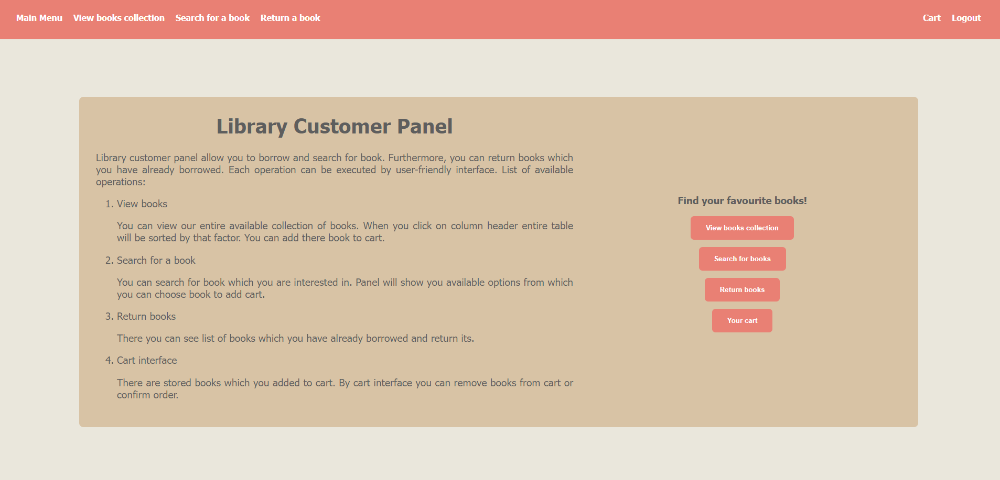

# Library Management Application

This is an application that allows managing a book library. The project was created in a Java environment with Spring Boot framework. To create views Spring MVC with Thymeleaf was used. Object are mapped to MySQL database with Hibernate. The application is secured with Spring Security. Project is also widely tested with unit tests and integration tests created with JUnit5 and Mockito.

## Initial Launch
The application is almost ready to use. To allow smooth testing of application features initial data is loaded before the first launch of the app. After first use, it is advised to change the property listed below to "update".
```
spring.jpa.hibernate.ddl-auto=create
```
The file is located in ```src/main/resources/application.properties```
## Explore the app's features
To make exploring app features easier initial data is loaded which is beneficial in testing new features. You can log in to customer or admin account whose credentials are listed below:
- ADMIN, email: ```admin@admin.com```, password: ```123Password##```
- CUSTOMER, email: ```user@user.com```, password: ```123Password##```

On the admin account, you can save new books to the database or change their current amounts. On the customer account, you can search for books, view ordered by chosen parameter book collection, or return books that you have borrowed before. Moreover, the app provides a cart feature that allows you to proceed orders.

Users can sing up by panel which is available on main page. The default user role is "customer".
## Technologies used
The app was created in purpose to enhance my knowledge in Java programming language and its most popular frameworks, which are presented below:
- Spring Boot
- Spring Security
- Passay
- Hibernate
- Thymeleaf
- JUnit5
- Mockito

The application is created with Maven. MySQL database is used to store data.
## Security and validation
The app is configured with Spring Security. There are configured two role: ```ROLE_ADMIN``` and ```ROLE_CUSTOMER```.
After successful authentication user is redirected to admin or customer main page, depending on its role. If user is not authorized to see page then access denied page is displayed. \
Note some facts:
- Sign in feature is built with the implementation of UserDetailsService.
- When the user tries to sign up then password is validated by custom rules created with Passay.
- All model objects are validated with the use of JSR annotations.

## Tests
The app is widely tested with unit tests and few integration tests. Test are created with JUnit5 and Mockito. JUnit Tags allow to run individually unit tests or integration tests. To run unit tests H2 in memory database is used.

## Screenshots

- - - -

- - - -
